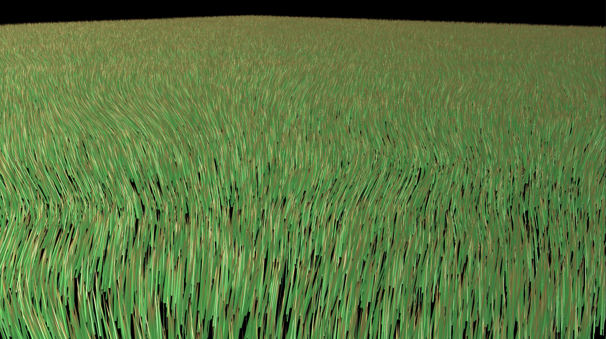
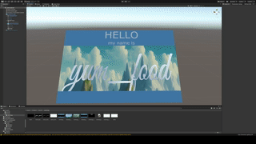
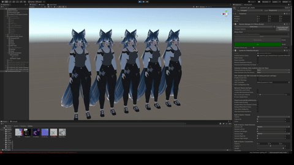

# Soggy Shaders

A collection of shaders by yum\_food.

MIT licensed: feel free to modify, redistribute, and sell!

To use, clone this repo somewhere inside your Unity assets folder.
Then assign the shader you want (like yum\_food/parallax) to a material.

Please ask setup questions [on the discord](https://discord.gg/YWmCvbCRyn).

## Grass (`yum_food/grass`)

A simple geometry shader that repeats a tile of grass 16 times and uses a noise texture to apply a wind effect on the geometry.

Right now only the noise texture is configurable.

Measured @ ~3.0 ms per frame at 4k

TODO: add a mask to enable controlling where grass spawns.

See `Shaders/grass/grass_10m_tile.prefab`.

## Parallax (`yum_food/parallax`)

A simple parallax shader with three parallax planes. Each plane can be textured with PBR textures: base color, normal, metallic, and roughness. The size, depth,
and emission strength of each plane is configurable.

In these demos, I have the shader on a quad.

Full demo video [here](https://youtu.be/WvPdqxmrZzI).

## Displacement (`yum_food/displacement`)

A simple displacement shader.

* Displacement height is specified with a texture.
* Height texture can be translated at configurable X/Y speeds, giving a
  flowy effect.
* Height can be masked to concentrate height mapping into specific areas.
* A built-in center-out effect is available.
* Basic physically-based shading is implemented (albedo with alpha, normal,
  roughness, metallic, cubemap).

In these demos, I have the shader on a 100x100 plane.

Full demo video [here](https://youtu.be/Giui4aCjtI0).

## Avatar cloning (`yum_food/avatar_clone`)

A cloning system using a geometry shader.

* Same features as the displacement shader.
* Spawn up to 4 clones at controllable x/y/z offsets (in meters).
* Clones spawn on the left or right side, in alternating order.

To use it in game:
* Assign the shader to all material slots you want to clone.
* Assign textures.
* Create 4 animations:
  * Set number of clones to 0.
  * Set number of clones to 4.
  * Set clone X offset to 0.
  * Set clone X offset to 1.
* Create 2 float params:
  * `Clone_Count`: controls number of clones.
  * `Clone_dx`: controls each clone's X axis offset.
* Create 2 layers in your FX layer:
  * One uses `Clone_Count` to blend between 0 and 4 clones.
  * One uses `Clone_dx` to blend between 0 and 1 x offset.
* Create two radial puppet controls, one for `Clone_Count`, and one for
  `Clone_dx`.

